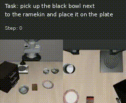
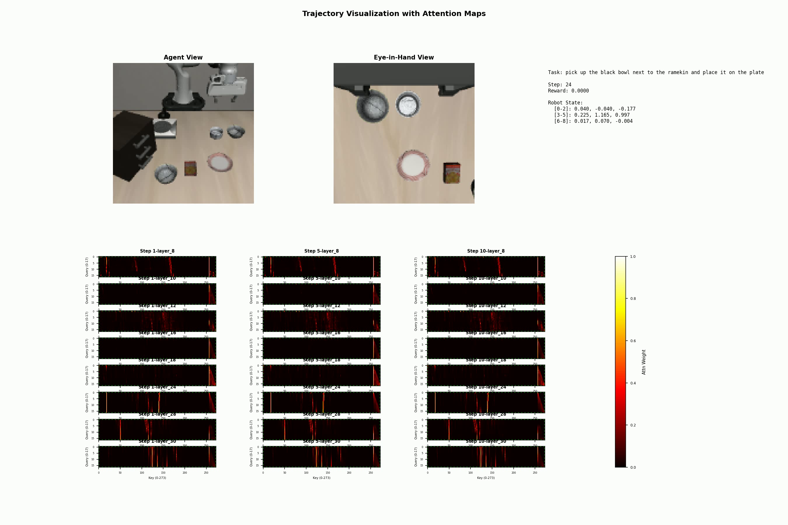

# VLAx
Personal code for VLA experiments in JAX. 

The repository contains code to train with flow matching a VLA action expert attending to a VLM gemma 3 backbone. The gemma backbone has been modified for a better fit on a consumer GPU (quantization, non batching of images processing, less token per img), see : [Repository link](https://github.com/Reytuag/gemma) for more infos on the modifications.

The repository also allows to test the trained network on Libero with visualization or not. 

